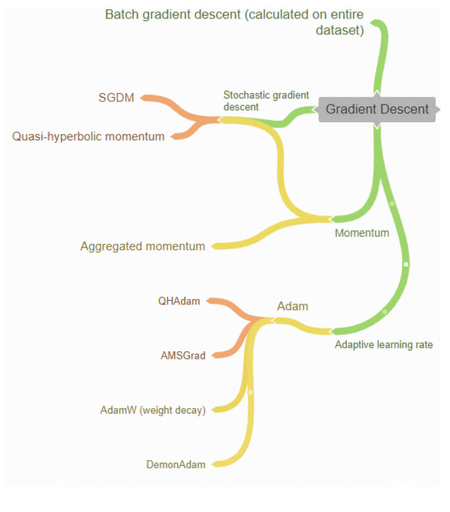

# Optimizer Survey

## Introduction
This study investigates optimization algorithms in Deep Learning, focusing on Gradient Descent. We explore different tasks, including Image and Text classification, as well as Image generation, employing 9 distinct optimization algorithms. The findings indicate that Adam-based techniques, such as QHAdam, AdamW, and Demon Adam, frequently outperform other methods in terms of learning effectiveness.

  

## Experiment
### Image classification
For this experiment, we utilize the CIFAR10 dataset. To assess both small and large model architectures, we employ LeNet and ResNet.

| LeNet/ResNet | Valid acc  | Valid F1    | Test acc     |Test F1     | Valid acc  | Valid F1    | Test acc   |Test F1     | Time complexity (s/epoch) |
|:-------------|:-----------|------------:|-------------:|-----------:|-----------:|------------:|-----------:|-----------:|--------------------------:|
|SGDM          | 65.600     | 65.325      | 65.260       | 65.152     | 74.020     | 73.615      | 73.110     | 72.847     | **6.992/15.205**          |             
|Adam          | 65.700     | 65.453      | 64.160       | 64.123     | 75.160     | 74.954      | 75.070     | 74.985     | 7.135/16.079              |
|AggMo         | 65.560     | 65.031      | 65.490       | 65.109     | 72.760     | 72.367      | 71.990     | 71.641     | 6.966/16.027              |
|QHM           | **67.220** | **66.638**  | **65.860**   | **65.523** | 74.320     | 74.064      | 73.140     | 73.000     | 7.111/16.006              |
|DemonSGD      | 65.440     | 65.350      | 65.070       | 65.118     | 73.100     | 72.627      | 73.280     | 73.118     | 7.149/15.622              |
|AMSGrad       | 65.020     | 64.684      | 64.700       | 64.700     | 75.120     | 74.793      | 73.660     | 72.512     | 7.313/15.965              |
|QHAdam        | 65.340     | 64.953      | 64.600       | 64.554     | 75.560     | 75.672      | **75.130** | **75.428** | 7.277/16.959              |
|DemonAdam     | 65.280     | 64.847      | 65.270       | 64.995     | 75.260     | 75.106      | 74.200     | 74.235     | 8.533/16.660              |
|AdamW         | 64.540     | 64.081      | 63.110       | 62.755     | **76.000** | **75.885**  | 75.030     | 75.081     | 8.294/16.723              |

### Text classification
We use the IMDb dataset for sentiment analysis, experiments are conducted using LSTM and BERT models.

| BERT/LSTM    | Valid acc  | Valid F1    | Test acc     |Test F1     | Valid acc  | Valid F1    | Test acc   |Test F1     | 
|:-------------|:-----------|------------:|-------------:|-----------:|-----------:|------------:|-----------:|-----------:|
|SGDM          | 81.200     | 81.199      | 80.900       | 80.898     | 79.000     | 78.985      | 79.790     | 79.783     |             
|Adam          | 81.175     | 81.083      | 82.090       | 82.022     | 82.000     | 81.970      | 81.470     | 81.439     |
|AggMo         | 81.450     | 81.422      | 81.170       | 81.151     | 81.700     | 81.697      | 80.620     | 80.618     |
|QHM           | 81.475     | 80.459      | 80.480       | 80.475     | 81.250     | 81.248      | 81.420     | 81.481     |
|DemonSGD      | **82.525** | 82.521      | 82.510       | 82.508     | 80.050     | 80.047      | 79.460     | 79.460     |
|AMSGrad       | 81.575     | 81.493      | 82.040       | 81.979     | **82.625** | **82.625**  | 81.950     | 81.950     |
|QHAdam        | 80.575     | **82.541**  | **82.790**   | **82.762** | 82.325     | 82.303      | **82.070** | **82.047** | 
|DemonAdam     | 81.425     | 81.353      | 82.380       | 82.316     | 82.200     | 82.197      | 81.890     | 81.888     |
|AdamW         | 80.600     | 80.516      | 82.010       | 81.949     | 82.075     | 82.074      | 81.410     | 81.410     |

### Image generation
In this task, we use the MNIST dataset to investigate the optimization algorithms. VAE model is conducted to generate data.

| Optimizer    | FID        | IS          | Time complexity (min)|
|:-------------|:-----------|------------:|---------------------:|
| SGDM         | 93.535     | 2.090       | **4.403**            |
| DemonSGDM    | 82.751     | 2.197       | 4.447                |
| DemonAdam    | 74.398     | 2.256       | 4.646                |
| Adam         | 74.447     | 2.151       | 4.565                |
| AMSGrad      | 74.511     | 2.220       | 5.696                |
| QHAdam       | **71.718** | 2.208       | 4.815                |
| QHM          | 95.078     | **2.043**   | 4.502                |
| AggMo        | 99.923     | 2.077       | 4.543                |
| AdamW        | 74.028     | 2.262       | 4.548                |

## Notable points
- All methods using the adaptive learning rate technique are sensitive to the large value of the initial learning rate.
- QHM-based algorithms show effective and stable performance in all scenarios.
- SGDM is the fastest optimizer since it contains a lack of overhead computation.
- 
More details can be found in our [technical report](https://github.com/NamCyan/Optimizer_Survey/blob/main/asset/optimizer_survey_report.pdf).

## Conclusion
In this project, we surveyed gradient descent optimization algorithms. They are all techniques that have become popular in recent times. The experimental results show that: Methods belonging to the adaptive learning rate group give better performances. The Adam-based methods are often the leading methods of learning effectiveness (QHAdam, AdamW, Demon Adam). In addition, Demon’s decay momentum strategy also showed a clear effect when significantly improving the original versions of SGDM and Adam.

## Contact us
This work is done at Hanoi University of Science and Technology (HUST)

If you have any discussion, please contact via nam.lh173264@gmail.com

